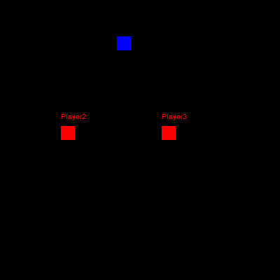
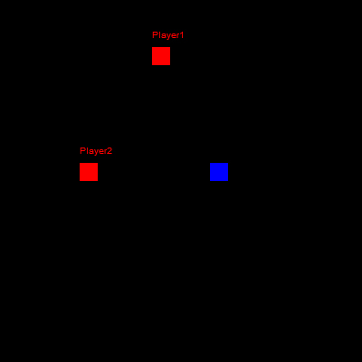

# Simple multiple clients test

A test for multiple clients on one server, each client is automatically updated as fast as possible and gets automatically removed when the clients session is terminated.

